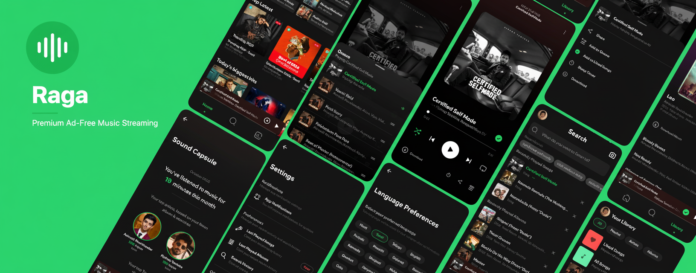
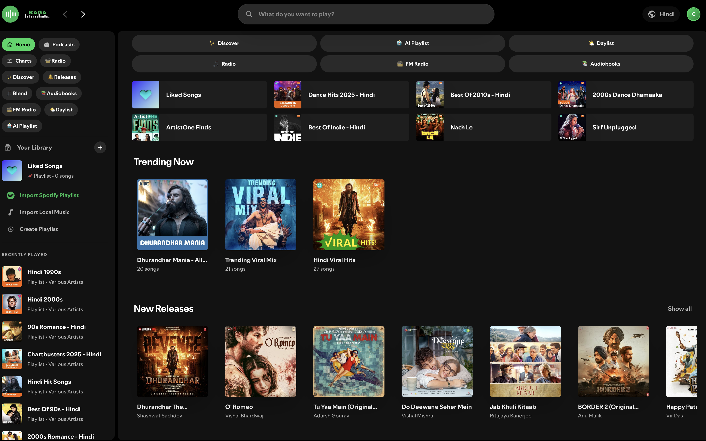
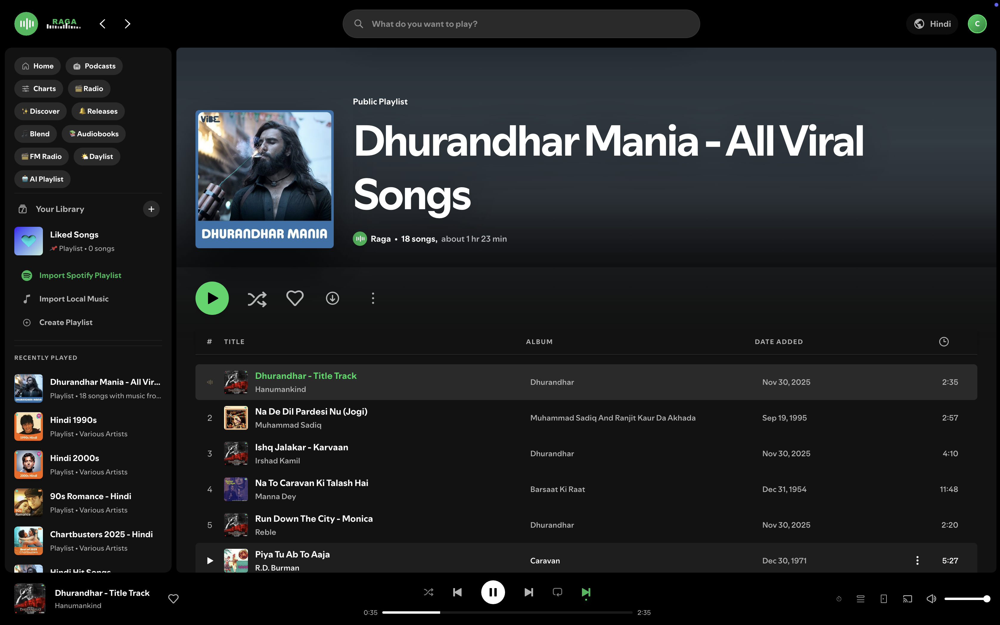
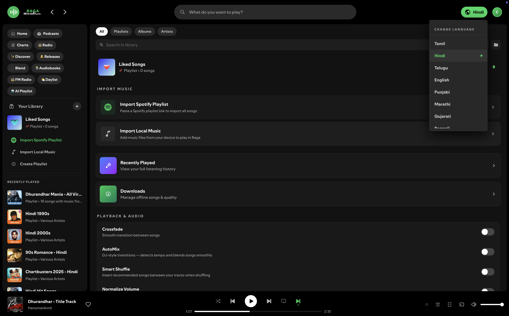
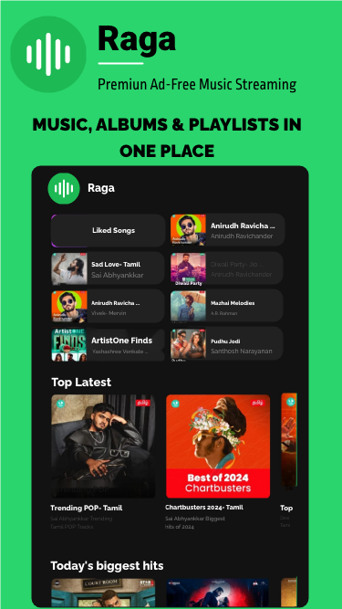
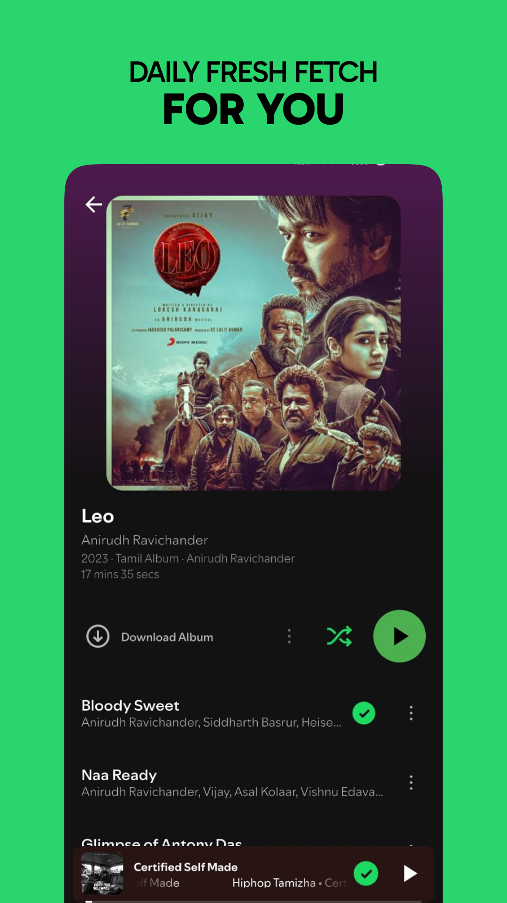
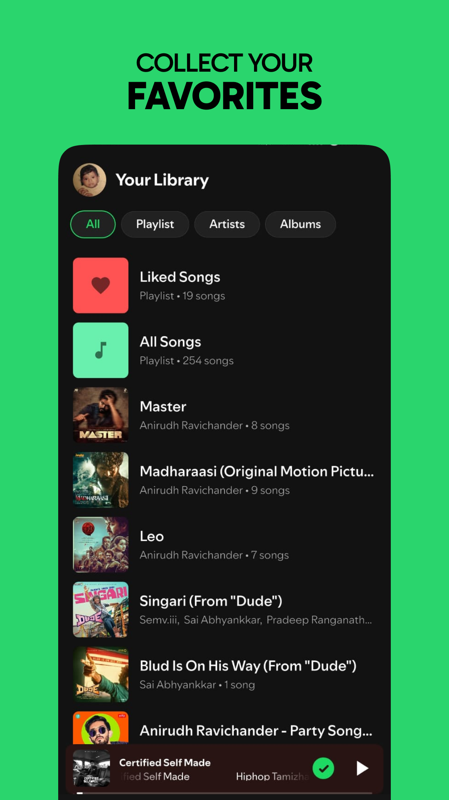
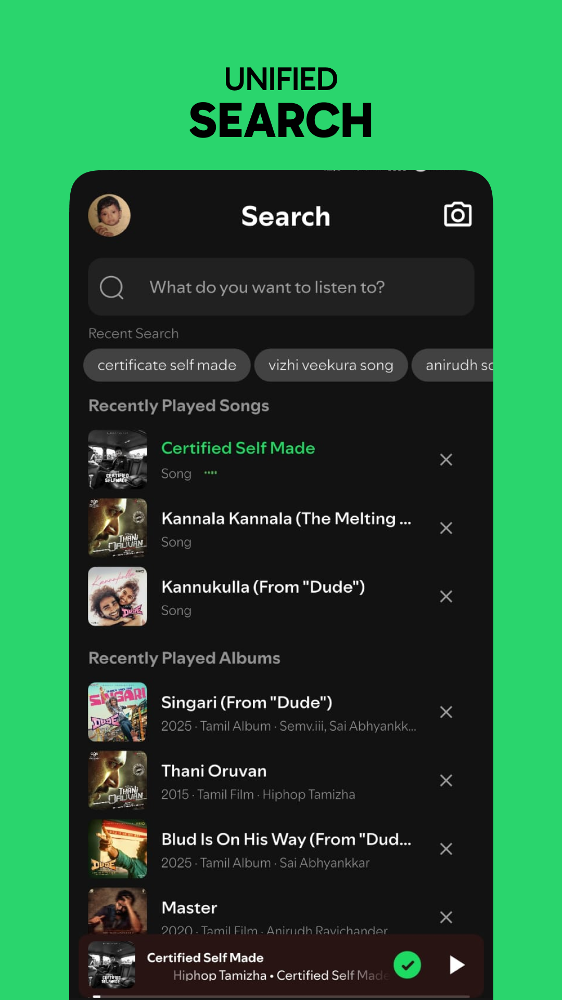

<h1 align="center">🎵 Raga</h1>

  

  
  
  

  <strong>👉 <a href="https://raga2141.vercel.app">Try Raga live — no install needed</a></strong>

  **Raga** is the browser-based **app** which is a full-featured, ad-free, privacy-first music streaming platform. It's a **FOSS, Spotify, JioSaavn inspired, ad-free, and offline-ready music streaming platform** built with **Next.js**.

Experience high-performance music streaming with trending charts, albums, and playlists — all **privacy-respecting, and cross-platform**. 🎵  
  
Stream millions of songs, discover podcasts, listen to audiobooks, import playlists from Spotify, Apple Music & YouTube Music, and more — all from your browser on iPhone, Android or Windows devices..

---

## 🚀 Live Demo

> **[raga2141.vercel.app](https://raga2141.vercel.app)** — open it on your phone or desktop and start streaming. Check **[Installation Steps Here](https://github.com/caliboycoder/raga-public/tree/main#-install-raga-as-an-app)** and enjoy the full experience.

---

## ✨ Features

### 🎧 Music Streaming & Playback
- Stream millions of songs in high quality
- Crossfade between songs (1–12 seconds, configurable with preview)
- AutoMix / DJ Transitions — BPM-aware crossfades with tempo detection and beat-matched timing
- Audio normalization for consistent volume across tracks
- Streaming quality selector (Auto, Low, Normal, High, Very High)
- Data saver mode for reduced bandwidth
- Background audio support on iOS, iPad, Mac, and Android
- Lock screen controls with artwork, previous/next track
- Autoplay — automatically finds similar songs when your queue ends
- Sleep timer with preset durations and "End of track" option
- Music Alarm — wake up to your favorite music at a set time
- Playback speed control (0.5× to 2×)
- Smart Shuffle with weighted randomization and recommended song insertion
- 8-band Equalizer with 11 presets (Bass Boost, Treble, Vocal, Rock, Pop, Jazz, Classical, Electronic, R&B, Lofi, Flat)
- Real-time Audio Visualizer synced to playback
- Cast support via Chromecast and AirPlay
- Player state persistence — resume song and position after refresh
- Mini lyrics on player bar — shows current synced lyric line while playing
- Swipe-up gesture on mobile mini player to expand Now Playing

### 🏠 Home Page
- Quick access: Discover, AI DJ, DJ Mixer, Genres, Daylist, Radio, FM Radio, Audiobooks
- Mood-based greeting with one-tap mood playlists
- Recently Played section
- 15+ curated sections: Trending Now, New Releases, community picks, and more
- Personalized Discover Weekly based on listening history and language
- Daily-refreshed content with smart caching
- Horizontal scroll carousels with navigation
- Animated RAGA wordmark logo with bouncing equalizer bars

### 🔍 Search & Discovery
- Global search for songs, albums, playlists, and artists
- Trending searches shown when search box is focused
- Unlimited results with "Load More" pagination
- Search history with recent searches
- SongCatcher — recognize songs by listening through your microphone
- Dedicated search for each category

### 🧭 Explore Hub
- Browse page with gradient category cards
- Trending Charts with play, shuffle, like, and download actions
- New Releases — latest albums and songs
- Discover — personalized daily mixes and "Made For You" recommendations
- Daylist — time-of-day playlist that changes mood based on hour and day
- AI DJ with two modes:
  - Auto DJ — hands-free personalized stream with commentary cards, adapts to time of day and listening history
  - Mood Prompt — describe a mood or activity in text, get a custom playlist with AI analysis
- DJ Mixer — two-deck mixer with turntable visuals, crossfader, speed control, and vinyl scratching
- Browse by Genre — 20+ language-specific genres
- Radio — 10 mood-based stations (Romantic, Party, Chill, Workout, etc.)
- Blend — create shared playlists mixing your taste with a friend's
- Song Radio — generate infinite playlist from any song
- Artist Radio — endless music from any artist
- Audiobooks — 40,000+ free public domain audiobooks
- FM Radio — live radio stations in 15+ languages

### 🎤 Artist Pages
- Artist profiles with popular songs, albums, and playlists
- Artist bio with biography, birth date, and social links
- Monthly listeners, followers, verified badge, and play counts
- Fans Also Like — related artists with pagination
- Follow/unfollow artists
- Start Song Radio or Artist Radio from any artist

### 🎙️ Podcasts
- Podcast discovery with 20+ language-aware categories
- Search podcasts with merged and deduplicated results
- Top podcasts by genre
- Episode progress tracking (resume where you left off)
- Mark episodes as played/unplayed
- Download episodes for offline listening
- Follow/subscribe to shows
- Episode show notes

### 📚 Audiobooks
- 40,000+ free public domain audiobooks
- Browse by genre (Fiction, Poetry, History, Philosophy, Science, etc.)
- Search by title or author
- Sequential chapter playback with full queue
- Download individual chapters or entire audiobooks
- Offline playback for downloaded chapters

### 📻 FM Radio
- Live radio stations from around the world
- 15+ language filters
- Search stations by name or tags
- Favorite stations with quick play
- Plays through the main player (no overlapping audio)
- Lock screen controls and background playback

### 📝 Lyrics & Song Info
- Real-time synced lyrics with line-by-line highlighting
- Lyrics Transliteration — convert scripts to Latin for singing along
- Karaoke / Sing Along Mode — full-screen karaoke with word-by-word highlight animation
- "Behind the Song" panel with album, release year, language, play count, and artists
- Song credits
- Share as Story Card — generates a shareable image for social media

### 📋 Library & Organization
- Create custom playlists with cover photo (upload or gradient picker)
- Edit playlist name and cover
- Add songs to multiple playlists at once
- Playlist folders for grouping
- Pin playlists/albums to top of library
- Sort (Recently Updated, Alphabetical) and filter (Playlists, Albums, Artists)
- Search within library
- Import playlists from Spotify, Apple Music, and YouTube Music (auto-detects platform from URL)
- Import local audio files (MP3, M4A, WAV, FLAC, etc.)
- Enhance playlist — AI-suggested songs that fit your playlist's vibe
- Like songs, albums, and playlists
- Playback History with Today / This Week / All Time filters

### 🎛️ Now Playing View
- Full-screen player with dynamic color background extracted from album art
- Animated album art with subtle zoom and glow
- Double-tap to like
- Swipe gestures (left/right = next/prev, down = close)
- 3-dot menu: Share, Story Card, Lyrics, Like, Add to Playlist, Queue, Album, Artist, Song Radio, Behind the Song, Download, Sleep Timer
- Audio Visualizer toggle
- Karaoke Mode
- Ambience — 36 ambient sounds with volume control and sleep timer
- Focus/Study Mode with timer

### 🎤 Karaoke / Sing Along Mode
- Full-screen karaoke with dynamic gradient background
- Synced lyrics with word-by-word highlight animation
- Transliteration button for non-Latin scripts
- Compact controls with progress bar

### 🌙 Ambience
- 36 ambient sounds across 6 categories: Nature, Rain, Animals, Things, Lofi, Focus
- Volume slider, sleep timer, auto-pause music toggle
- Binaural beats and focus tones included

### 🧘 Focus / Study Mode
- Full-screen immersive dark UI
- Timer presets: 15 min, 25 min (Pomodoro), 45 min, 1 hr, 2 hr, or infinite
- Auto-pause music when timer ends
- Breathing circle animation
- Dynamic background from album art

### 📥 Downloads & Offline
- Download manager with progress tracking
- Download quality settings (Low, Normal, High, Max)
- Smart downloads toggle
- Offline songs list with remove/clear all
- Background download queue
- Audiobook and podcast episode downloads
- Automatic offline playback
- Offline Smart Banner with "Play Offline" quick action

### 🎵 Queue Management
- Full queue panel (mobile overlay + desktop sidebar)
- Play Next / Add to Queue
- Drag to reorder, move up/down, remove songs
- Edit mode, clear queue, shuffle, repeat, sleep timer

### 📊 Stats, Recap & Wrapped
- Listening stats dashboard with Overview and Monthly Recap
- Total plays, listening time, top songs, top artists
- Monthly breakdown with month selector
- Wrapped — year-end slideshow (overview, top artist, top song, top 5 lists)
- Profile page with top artists, top songs, playlists, recent activity
- Share profile and Wrapped stats

### 👤 Account & Cloud Sync
- Google Sign-In
- Email/Password authentication
- Cloud sync — save playlists, likes, and settings across devices
- Account avatar across all pages

### ⚙️ Settings
- Crossfade toggle with duration slider and preview
- AutoMix toggle for BPM-aware DJ transitions
- Smart Shuffle toggle
- Audio normalization
- Streaming quality selector
- Data saver mode
- Explicit content filter
- Private session mode
- Music Alarm
- Dark / Light / System theme
- Keyboard shortcuts overlay
- Export/Import data backup
- Cache management

### ⌨️ Keyboard Shortcuts
| Key | Action |
|-----|--------|
| Space | Play / Pause |
| → | Next song |
| ← | Previous song |
| ↑ | Volume up |
| ↓ | Volume down |
| M | Mute / Unmute |
| S | Toggle shuffle |
| R | Toggle repeat |
| L | Like current song |
| Q | Toggle queue |
| / | Focus search |
| ? | Show shortcuts |
| Esc | Close overlay |

### 📱 Cross-Platform & PWA
- Responsive design for iPhone, iPad, Android, and Desktop
- iOS Dynamic Island / notch safe area support
- PWA installable with offline support
- Background audio on all platforms
- Lock screen artwork and controls
- Haptic feedback on supported devices
- Pull-to-refresh on iOS PWA
- Service worker with smart caching and offline fallback

### 🎨 UI/UX
- Spotify-inspired dark theme with light mode support
- Dynamic color backgrounds from album art
- Animated logo with equalizer bars
- Consistent pagination across all pages
- 3-dot context menus on every song
- Custom playlist covers with photo upload or gradient picker
- Toast notifications, loading skeletons, error boundaries
- Safe area support for modern devices

---

## 🖼️ Screenshots

  

### 💻 Desktop & Tablet

  

  

  

### 📱 Mobile

  
  
  
  
  

---

## 📲 Install Raga as an App

Raga is now a **multi-platform music ecosystem**. You can install Raga directly from your browser with no app store needed.

### 🍎 iPhone / iPad (Safari)
1. Open **Safari** and visit the Raga website
2. Tap the **Share** button (square with arrow pointing up) at the bottom of the screen
3. Scroll down and tap **Add to Home Screen**
4. Tap **Add** in the top-right corner
5. Raga will now appear on your Home Screen like a native app

> **Note:** You must use Safari, Chrome or FireFox on iOS to install this app.

### 🤖 Android (Chrome / Edge / Brave)
1. Open **Chrome** and visit the Raga website
2. Tap the **3-dot menu** in the top-right corner
3. Tap **Install app** or **Add to Home screen**
4. Tap **Install** to confirm
5. Raga will be added to your app drawer and home screen

> **Tip:** You may also see a banner at the bottom of the page prompting you to install.

### 💻 Windows / Mac / Linux Desktop (Chrome / Edge)
1. Open **Chrome** or **Edge** and visit the Raga website
2. Look for the **install icon** (a small monitor with a down-arrow) in the address bar on the right
3. Click it and select **Install**
4. Alternatively: click the **3-dot menu** → **Apps** → **Install this site as an app**
5. Raga will open in its own window and appear in your Start Menu, Dock, or Applications folder

> **Tip:** On Edge, you can also right-click the tab and select **Install Raga**.

### ✨ Benefits of Installing
- Launches from your home screen or app drawer like a native app
- Runs in its own window without browser tabs or address bar
- Offline support for downloaded songs, audiobooks, and episodes
- Background audio with lock screen controls
- Faster load times and a more immersive experience

---

## 🐛 Found a Bug?

If you run into any issues, unexpected behavior, or bugs while using Raga, feel free to open a [GitHub Issue](https://github.com/caliboycoder/raga-public/issues). Please include steps to reproduce the problem and your device/browser info so we can look into it.

---

## ⚠️ Disclaimer

> Raga is built for educational and research purposes. The app does not host or distribute any copyrighted media. All rights belong to their respective owners. Audiobooks are sourced from public domain collections. Podcast metadata is sourced from publicly available directories.

## ⭐ Star the Repo

If Raga inspired you, show your support by starring ⭐ it on GitHub!
